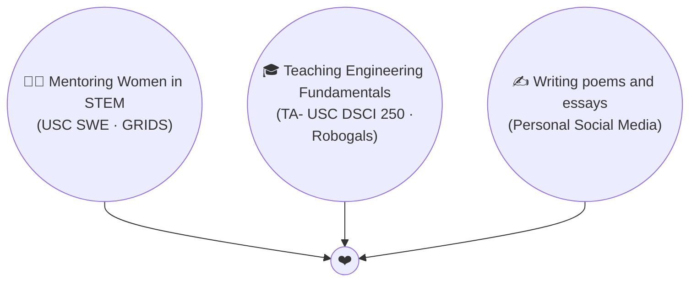

# Hi, I'm Shriya 👋

There's a person at the end of every pipeline. I take my work seriously when it comes to delivering high-quality products.

 

  

 

<table align="center">
<tr>
<td align="center" width="200">

### 🧠
**LLM & RAG**
 
Bedrock · Claude · RAG · Semantic Search · Embeddings · Vector DBs · Prompt Engineering

</td>
<td align="center" width="200">

### 👁️
**Computer Vision**
 
CNNs · ResNet · MobileNet · SageMaker · Image Classification · Disaster Assessment

</td>
<td align="center" width="200">

### 🛡️
**AI Evaluation & Safety**
 
LLM-as-Judge · Guardrails · Red-Teaming · PII Redaction · Hallucination Mitigation

</tr>
</table>

 

---

### Tech Stack

 

---

### 🌱 Outside the Code

---

If your work lives somewhere between messy data, useful AI and real-world impact, I’d love to connect!

